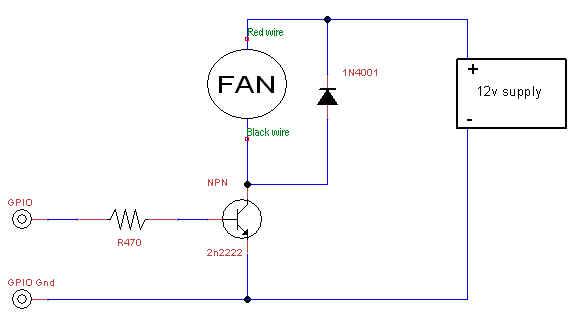
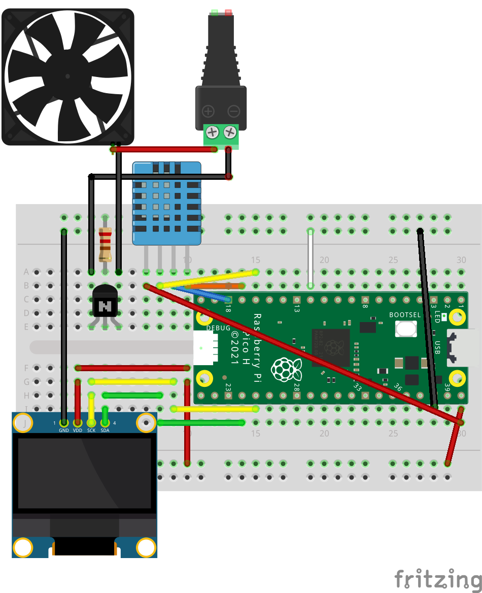
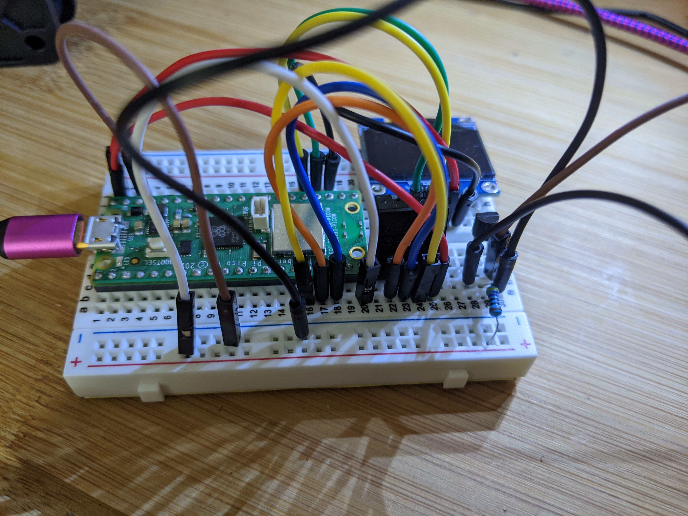
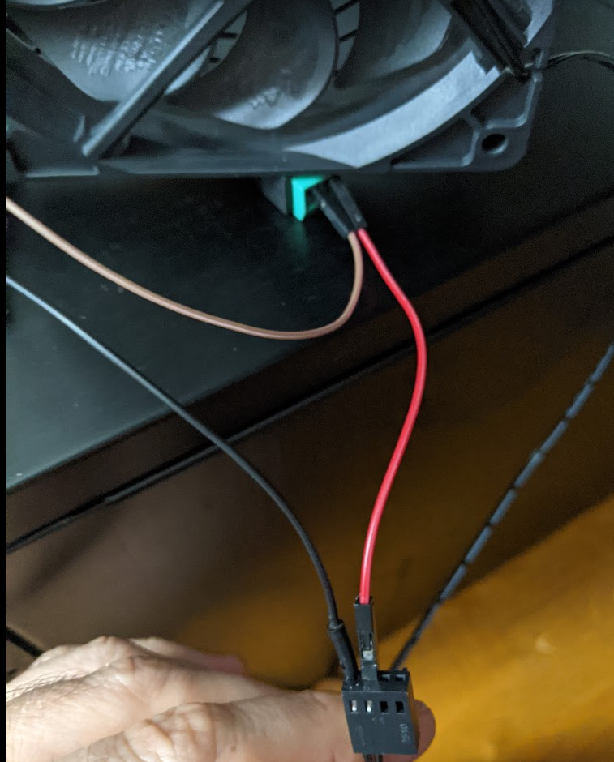

# pico_thermostat
Thermostat using a Raspberry Pi Pico

This Circuit uses a [2222 npn transistor](https://www.adafruit.com/product/756), Raspberry Pi Pico, and [dht20](https://www.adafruit.com/product/5183) to control a 12V DC fan if the temperature is over a threshold you define.
An OLED screen is also setup to view the temperature and output.

**Credits**
|[dht20 driver](https://github.com/flrrth/pico-dht20)|[ssd1306  driver](https://github.com/stlehmann/micropython-ssd1306/blob/master/ssd1306.py)|[Circuit and Image](https://forums.raspberrypi.com/viewtopic.php?t=219897&sid=7d5c8cef37829fa4a5cbb0610ec2d0c3)|

This is the basic premise using the transitor:

**Pico Pi Pin Setup to Transistor:**

Collector - Black Wire of the DC fan 
 
Base      - 470 Ohm resistor to power/+ on  breadboard rail 
 
Emitter   - Black wire of the 12 V power  
Emitter   - also to ground/- on the breadboard rail  

Pico GPIO 15   - to power/+ on the  breadboard rail  

Pico Pin 38 (gnd) to ground/- on the breadboard rail (shared ground)  

Red wire of the 12 V power supply - to red  wire of the DC Fan  

**Fritzing Sketch**

**Pics:**

**dht20 Connections:**
sda = Pin(12)  

scl = Pin(13)  

GND = GND  

VCC = Pico Pin 40  

**OLED Connections:**
sda =Pin(18)  

scl=Pin(19)  

GND = GND  

VCC = Pico Pin 40  

**Install:**
- Upload this whole repo into / on the pico using a recent version of micropython
- Edit TRIGGER_TEMP to your desired temperate trigger

